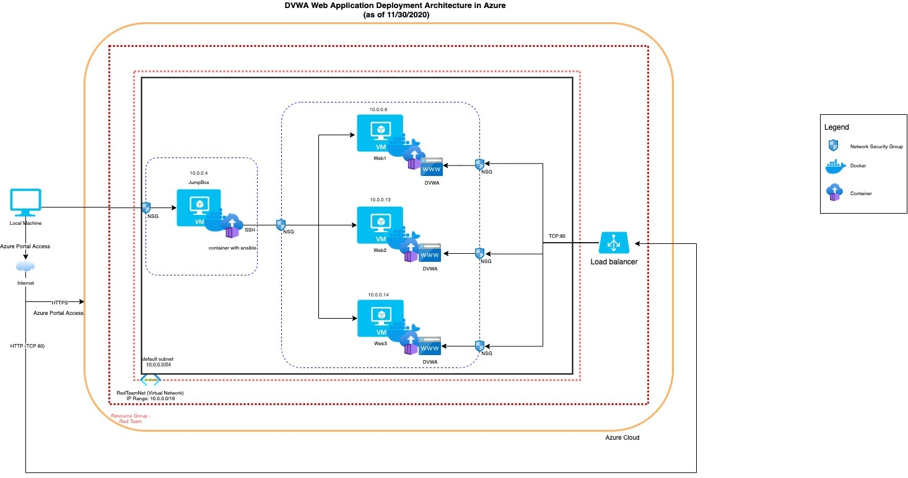
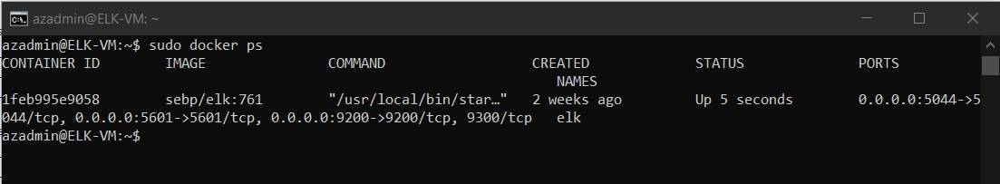
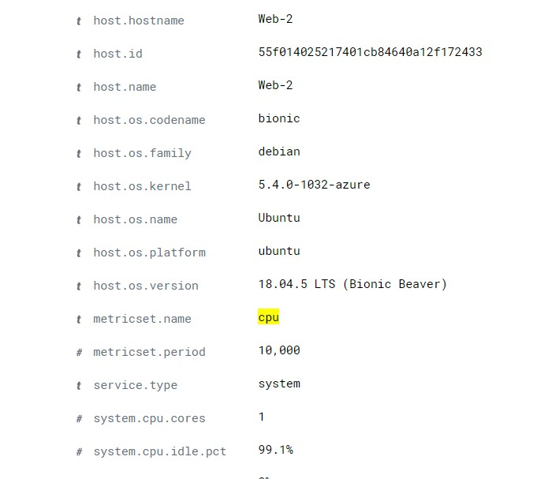
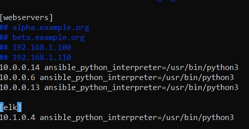
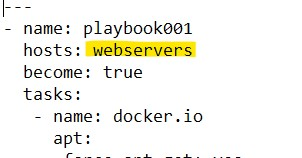
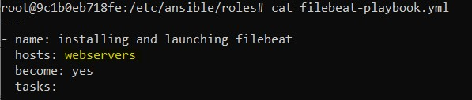
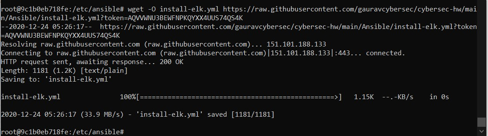

## Automated ELK Stack Deployment

The files in this repository were used to configure the network depicted below.

These files have been tested and used to generate a live ELK deployment on Azure. They can be used to either recreate the entire deployment pictured above. Alternatively, select portions of the Ansible folder may be used to install only certain pieces of it, such as Filebeat.

  - _myplaybook.yml_

This document contains the following details:
- Description of the Topology
- Access Policies
- ELK Configuration
  - Beats in Use
  - Machines Being Monitored
- How to Use the Ansible Build

### Description of the Topology

The main purpose of this network is to expose a load-balanced and monitored instance of DVWA, the D*mn Vulnerable Web Application.

Load balancing ensures that the application will be highly available, in addition to restricting traffic to the network.
- Load balancers can help route the traffic to backend servers based on various algorithms like round-robin, latency or performance. The security that these provide is that they restrict access to backend pool servers from internet. Only load balancer is publicly available and backend pool servers can be on internal network.  
- The advantage of jump box is we only need to make one VM publicly available for SSH instead of making all backend application servers public. This protects backend application servers from unauthorized access and related threats from the internet. Having a jumpbox and protecting it is much easier than having backend application servers on public network and protected each of them.

Integrating an ELK server allows users to easily monitor the vulnerable VMs for changes to the configuration and system performance.
- Filebeat watches log files or locations that are specified during setup. It collects the log events and forwards them to ElasticSearch or Logstash for indexing.
- Metricbeat records system and application metrics. It is helpful to monitor cpu/mem/disk/network metrics as well as metrics from Apache, Docker, Nginx, Redis, etc.

The configuration details of each machine may be found below.
_Note: Use the [Markdown Table Generator](http://www.tablesgenerator.com/markdown_tables) to add/remove values from the table_.

| Name     | Function | IP Address | Operating System |
|----------|----------|------------|------------------|
| Jump Box | Gateway  | 10.0.0.4   | Linux            |
| Web-1    |App Server| 10.0.0.13  | Linux            |
| Web-2    |App Server| 10.0.0.6   | Linux            |
| Web-3    |App Server| 10.0.0.14  | Linux            |
| ELK-VM   |ELK Server| 10.1.0.4   | Linux            |

### Access Policies

The machines on the internal network are not exposed to the public Internet. 

Only the Jump Box machine can accept connections from the Internet. Access to this machine is only allowed from the following IP addresses:
- 73.223.89.101 (local machine IP address)

Machines within the network can only be accessed by SSH from Jumpbox.
- _ELK VM can only be accessed with SSH from Jump Box 10.0.0.4. ELK VM web app can be accessed on port 5601 with http from 73.223.89.101 (local machine IP address)_

A summary of the access policies in place can be found in the table below.

| Name     | Publicly Accessible | Allowed IP Addresses |
|----------|---------------------|----------------------|
| Jump Box | Yes                 | 73.223.89.101        |
| Web-1    | No                  | 10.0.0.4             |
| Web-2    | No                  | 10.0.0.4             |
| Web-3    | No                  | 10.0.0.4             |
| ELK-VM   | Yes                 |73.223.89.101;10.0.0.4|

### Elk Configuration

Ansible was used to automate configuration of the ELK machine. No configuration was performed manually, which is advantageous because...
- _All changes can be tracked to ansible yml file (IAC)_
- _It can be easily rebuilt if necessary_
- _It can be reused to build ELK machines for other stacks._

The playbook implements the following tasks:
- _install Docker; download image; etc._
- _install pyton;_
- _install Docker;_
- _Download and lauch web container image cyberxsecurity/dvwa and start with ports 80:80;_
- _Enable Docker Service;_

The following screenshot displays the result of running `docker ps` after successfully configuring the ELK instance.

-

### Target Machines & Beats
This ELK server is configured to monitor the following machines:
- _10.0.0.6_
- _10.0.0.13_
- _10.0.0.14_

We have installed the following Beats on these machines:
- _Filebeat_
- _Metrixbeat_

These Beats allow us to collect the following information from each machine:
- _Filebeat collects log files under /var/log/ folder, which we use to track logon events, cronjob logs, authentication and authorization logs etc. Example: /var/log/secure log contains information related to authentication and authorization privileges. For example, sshd logs all the messages here, including unsuccessful login_
- _Metricbeats periodically collects system-wide and per-process CPU and memory statistics. Example it can be used monitor cpu usage.
- 

### Using the Playbook
In order to use the playbook, you will need to have an Ansible control node already configured. Assuming you have such a control node provisioned: 

SSH into the control node and follow the steps below:
- Copy the install-elk.yml file to /etc/ansible/ folder.
- Update the hosts file to include ELK-VM Private IP address and Web VM Private addresses.
- Run the playbook, and navigate to Kibana app in Web browser (http://ELK-VM-PUBLIC_IP:5601/app/kibana) to check that the installation worked as expected.

- _Which file is the playbook? install-elk.yml Where do you copy it? /etc/ansible/_
- _Which file do you update to make Ansible run the playbook on a specific machine? hosts How do I specify which machine to install the ELK server on versus which to install Filebeat on? In hosts file, create tags like below for ELK and webservers and then specify these tag names under hosts in playbooks._
- Example:
- _hosts file_
- 
- _myplaybook.yml_
- 
- _filebeat-playbook.yml_
- 

- _Which URL do you navigate to in order to check that the ELK server is running? http://ELK-VM-PUBLIC_IP:5601/app/kibana

_Commands_
- Assuming you are already in the container and in /etc/ansible folder, Get RAW link to the file from Github and download install_elk.yml file
using the command _wget -O install-elk.yml <RAW_LINK>_
- 
- Update hosts file : _vi /etc/ansible/hosts_ to update Private IP addresses of ELK server and Web servers
- To run playboook : _ansible-playbook /etc/ansible/install-elk.yml_
